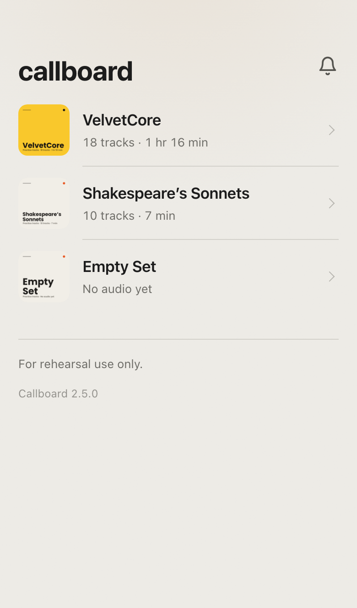
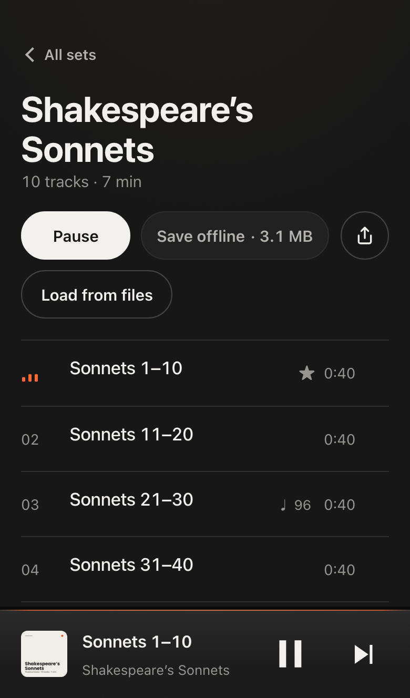

# Callboard

A WordPress plugin for a cast's rehearsal tracks. The stage manager posts the call. The cast opens it on their phones, taps a number, and the track plays. Works offline, installs from Safari, needs no accounts.

<a href="https://promptcorner.github.io/callboard/">Landing page and live demo</a> · <a href="https://playground.wordpress.net/?mode=seamless&blueprint-url=https://promptcorner.github.io/callboard/blueprint.json">Open in WordPress Playground</a> · <a href="https://github.com/promptcorner/callboard/releases/latest">Latest release</a>

    

<table>
<tr>
<td align="center" width="33%"> The board</td>
<td align="center" width="33%"> A set</td>
<td align="center" width="33%"> Posting a call</td>
</tr>
</table>

## What it does

- **Board.** The home page shows the next call: time, place, note, and the numbers being worked. Each number is a tap that starts the track. A call is a post under Sets. Publishing one sends a push notification.
- **Sets.** A set is a post; its tracks are audio attachments. Fetch a playlist with WP-CLI, or import a folder of audio.
- **Player.** A bar at the foot of every page with the artwork, what is playing, and previous, play, next. Tap it and Now Playing fills the screen: the cover, the waveform, elapsed and remaining, and what the copy actually is. Waveform scrubbing, an A/B loop (two fingers on the wave, or the bracket keys), count-in, lyrics and director's notes in time with the track, AirPlay, and lock-screen controls. The tab title carries the track as well, for whoever has the board open behind a rehearsal PDF.
- **Offline.** Save a set once. It plays from the phone with no connection, or load it from a file when there is no signal to save it with.
- **Settings.** Site name, accent colour, badge, confetti behind a triple tap on the title. Hooks and template overrides for developers.

## Getting started

1. Install `callboard.zip` from the [latest release](https://github.com/promptcorner/callboard/releases/latest). WordPress 6.5+, PHP 8.1+.
2. Add a set. With `yt-dlp` and `ffmpeg` installed where WP-CLI runs: `wp callboard fetch '<playlist url>' --name="Spring Show"`. Otherwise put audio files and a `manifest.json` in `wp-content/uploads/callboard/<slug>/` and use Sets → Import. `wp callboard doctor` reports what is available.
3. Post a call under Sets → Calls. Publish it or schedule it.
4. Share the home page URL. On iPhone, the cast adds it to the Home Screen. The bell turns on notifications where the host supports Web Push (PHP with OpenSSL and GMP or BCMath).
5. Adjust Sets → Settings.

## Contents

- [How it works](#how-it-works)
- [Developer API](#developer-api)
- [WP-CLI](#wp-cli)
- [Web APIs used](#web-apis-used) and [watchlist](#watchlist)
- [Tests](#tests), [releases](#releases), [CONTRIBUTING](.github/CONTRIBUTING.md)

## How it works

Rendering and navigation

`Router` handles two routes: the home page and `/<set-slug>/`. Unknown paths show the home page with a note. `Frontend` renders from `templates/` on `template_redirect` and loads only the plugin's stylesheet and script, core's `wp-hooks` underneath it, and the assets of registered extensions. The theme is not used.

Navigation is client-side. The script fetches the target URL with `?fragment=1`, which returns the view without the page shell, and swaps it into `<main>` inside a view transition. PHP is the only renderer. Fetching starts on the first touch of a link. The home fragment is prefetched when idle.

Elements that change state after load (save marks, header buttons, the AirPlay picker) are rendered in place and hidden, so nothing shifts when the script runs.

No build step

`assets/app.js` is one IIFE, `assets/app.css` is one file. No bundler, framework, or transpiler. The plugin has to keep working on sites nobody maintains, and a build chain is the first thing to break. Every browser feature is behind a check; CSS degrades through `@supports` and media queries. `Pwa::write_files()` writes the service worker and manifest to the site root, since a worker only controls the scope it is served from.

Design rules: animate only transform and opacity, never use font weight for state, prefer native controls, one set of colour tokens for both schemes.

Data model

| Where | What |
| --- | --- |
| `callboard_call` post | Title and body. `_callboard_when` (site time zone, empty for a notice with no time), `_callboard_where`, `_callboard_numbers` (attachment ids). Leaves the board six hours after its time |
| `callboard_set` post | Name, slug, order, credits, source link, share image |
| Audio attachment | A track. `menu_order` is its position. Quality shown to listeners — bit depth and sample rate for lossless, bitrate and sample rate for lossy — reads WordPress's own attachment metadata, not a callboard field; lossy formats show no bit depth, since MP3 does not have one |
| `_callboard_duration` | Seconds |
| `_callboard_levels` | Loudness envelope, digits 0–9, ten per second. Drives the waveform and the filament, which auto-ranges to its own recent peak — rising at once, forgotten over ~6s — so a quiet reading lights it as fully as a loud mix. iPhones cannot analyse audio live |
| `_callboard_lyrics`, `_callboard_lyrics_approved` | Timed lines from captions, shown after approval |
| `_callboard_notes` | Director's notes with a time and date |
| `_callboard_bpm` | Tempo, for the count-in |
| `_callboard_practice` | Anonymous practice counts per hour, written only while **Count practice** is on |
| `_callboard_video_id`, `_callboard_source_url`, `_callboard_uploader` | Source. The uploader is also sent per track as `artist` — right for one playlist by one uploader, wrong for a set where every track differs |
| `_callboard_codec`, `_callboard_reencoded` | What a fetch actually got (e.g. `aac`) and whether `ffmpeg` had to re-encode to get it — provenance, not a measurement of the file itself |

`Sets` builds the data the front end renders, cached in a transient for a day and cleared on save.

Import

1. **Fetch.** `Fetcher` runs `yt-dlp` (and `ffmpeg` when it needs to) on a YouTube URL, playlist, or search and writes `wp-content/uploads/callboard/<slug>/`: the audio, a `manifest.json`, and sidecars keyed by video id (`levels.json`, `lyrics.json`, `notes.json`, `tempo.json`). It keeps the native m4a/AAC stream YouTube already serves rather than re-encoding it — re-encoding a lossy source is a pure loss, and can even inflate the bitrate while making it sound worse — and only asks `ffmpeg` to convert when a video truly offers no AAC audio, preferring m4a there too and falling back to mp3 only if the ffmpeg build cannot encode AAC at all. A search (yt-dlp's `ytsearch:` syntax) is narrowed to one candidate first: an auto-generated "Topic" upload, then a channel YouTube has verified, skipping obvious live versions, covers and remixes where another copy exists. Binary paths are filterable.
2. **Import.** `Importer` reads that folder into posts. The folder is only an input; posts are the source of truth. Re-importing refreshes order, credits, and lyrics but keeps titles edited in the admin.

Hosts that cannot run binaries: build the folder on a laptop with the same command, upload it, import. `Requests` is an admin queue of URLs; `wp callboard run` drains it where the tools exist. Because `Requests` only accepts a real YouTube URL, a search query is a WP-CLI-only way in for now.

3. **The file.** `Exporter` writes that same folder as a single `.callboard` file, and reads one back. The manifest carries a `version`; a reader refuses a file newer than it understands. Unzipped it *is* an import folder, so `Importer` reads it without knowing it was ever a file, and somebody with no Callboard still has playable audio in the right order with a cover. Entries are extracted by name, never with `extractTo()`, since a set is a flat folder and anything carrying a path separator is not ours to write.

4. **The stick.** `--format=car` writes a plain folder instead: `01 Title.mp3`, in order, each tagged so it names itself on a dash, with the cover embedded and beside them as `folder.jpg`. `Id3` writes ID3v2.3 by hand — WordPress bundles getID3's reading modules but not its writing ones, and five frames are not worth a dependency. Latin-1 where the text fits it, UTF-16 where it does not, and JPEG artwork because head units read it far more reliably than PNG.

Offline

The service worker precaches the shell and the home fragment. Saving a set streams each track into the Cache API and fetches the set's fragment. The worker serves cached audio and answers `Range` requests, so seeking works offline. Saved sets are re-fetched on the home screen after an update because the shell cache is versioned. The Cache API is used instead of IndexedDB or OPFS because it serves whole files with Range support, which is what the media element needs.

**Load from files** fills the same cache without the network, for a phone on bad signal standing next to somebody who has the audio on a stick. Files are matched to tracks by the track's own file name, then by a leading number, which is how a car-format export is named, then by title; anything unmatched is reported rather than guessed at. A sideloaded copy carries a marker, because it can be a different size from the server's — a car export has ID3 tags the original does not — and without it the next check would call it stale and download it again.

Push

`Push` stores subscriptions through a REST route and sends with [web-push-php](https://github.com/web-push-libs/web-push-php). Payloads use declarative Web Push so Safari shows them without waking the worker. A `pushsubscriptionchange` handler re-subscribes when a browser rotates an endpoint. VAPID keys are generated with OpenSSL and stored in an option.

Privacy

`Privacy` adds `noindex` via `wp_robots` and `X-Robots-Tag`, disallows everything in `robots.txt`, sets `Referrer-Policy: no-referrer`, requires authentication for REST except the push routes, hides the users endpoint, disables XML-RPC and feeds, and redirects author archives and search to home.

`Gate` is the one decision about who may see the front end, and it is off by default: a link in a group chat is the whole setup, and that is the point. Turn on **Require a WordPress sign-in** and the answer becomes `is_user_logged_in()` and nothing else, so whatever sign-in the site already has guards the app too — Apple, Google, a membership plugin, passkeys through Two Factor and its WebAuthn provider. Core still ships no passkeys of its own. Also turn on **Only let in users with access to Callboard** and a signed-in user needs the `view_callboard` capability too. `callboard_can_view` overrides the settings; return `null` and the filter never has to know what they say.

`Roles` adds two roles. **Director** can post calls, edit playlists and their track notes, and send notifications from Notices. **Cast member** can only open the front end. Each post type has its own capabilities (`edit_callboard_calls`, `edit_callboard_playlists`, and so on), and on activation or update every other role gets the ones that match the post capabilities it already has. Administrators, editors, authors and contributors keep what they could do before. Deleting the plugin removes the roles and capabilities.

**Count practice** is off by default. When it is on, the page counts how many times each track is opened, how many loops are set on it and how many seconds it plays, and sends those totals to the site. They are stored on the track, grouped by hour, and shown on each call in the editor. No user id, name, IP address or cookie is stored with them.

A gated request answers 403 with `templates/gate.php` rather than redirecting to `wp-login.php`, which would drop the cast out of an installed app and into WordPress branding mid-session. Nothing about the sets escapes it: the script and its data are not enqueued, link previews are suppressed, and the document title falls back to the site name. Audio files keep their own upload addresses either way, so the gate guards the app, not the media.

Artwork

`Art` draws covers, share cards, and iPhone splash screens with GD from the set's name.

Repository map

| Path | Purpose |
| --- | --- |
| `callboard.php` | Plugin header, constants, autoload |
| `uninstall.php` | Removes the roles and capabilities when the plugin is deleted |
| `includes/` | One class per concern: `Plugin`, `Router`, `Frontend`, `Sets`, `Calls`, `Post_Types`, `Admin`, `Settings`, `Importer`, `Exporter`, `Id3`, `Fetcher`, `Requests`, `Push`, `Pwa`, `Privacy`, `Gate`, `Roles`, `Art`, `Cli`. `helpers.php` has icons and formatting |
| `templates/` | `index.php` (shell), `fragment.php`, `home.php`, `board.php`, `set.php`, `deck.php` (player), `gate.php`, `footer.php` |
| `assets/` | `app.js`, `app.css` |
| `pwa/sw.js` | Service worker source |
| `tests/e2e/` | Playwright suites |
| `tests/fixtures/` | `demo-set` and `empty-set`, and `librivox.js`, which builds the demo audio from LibriVox recordings. `local-set.js` builds a set from your own audio into a gitignored folder, for local listening only |
| `blueprint.json` | Playground demo. The Pages workflow publishes it with the plugin zip and demo audio, stamped by commit |
| `site/` | Landing page (GitHub Pages) |
| `languages/callboard.pot` | Translation template; `npm run pot` regenerates it |
| `scripts/sync-versions.sh` | Writes the release version into the plugin files |
| `scripts/screenshots.js` | Retakes the landing-page screenshots from a running wp-env site, at the exact sizes the page expects. `node scripts/screenshots.js demo` retakes only the live demo previews |
| `scripts/wporg-screenshots.js` | Regenerates the wordpress.org screenshots in `.wordpress-org/` from a running wp-env site, using `scripts/wporg/template.html`. `.wordpress-org/screenshots.json` sets each screenshot's page, headline, and readme.txt caption. `tests/e2e/wporg-screenshots.spec.js` checks the captions and image sizes match |
| `.github/` | Workflows, Dependabot, PR template, CONTRIBUTING |
| `AGENTS.md` | Notes for coding agents |

## Developer API

Features are extensions: an id, a version, and named contribution points shared between PHP and the page. Callboard's own count-in, quality readout and Home Screen badge are built that way, so a plugin can switch one off, replace it, or add its own beside them. [Extending Callboard](docs/extending.md) is the contract: the points, the lifecycle, events, state and commands, escaping, and what version 1 promises.

PHP

| Function or hook | Kind | What it does |
| --- | --- | --- |
| `callboard_register_extension( $id, $args )` | function | Register an extension on `callboard_register_extensions`. `callboard/*` is reserved |
| `callboard_unregister_extension( $id )` | function | Remove one, Callboard's own included |
| `callboard_get_extension( $id )`, `callboard_get_extensions()` | functions | Read the registry |
| `callboard_slot( $slot, ...$context )`, `callboard_get_slot()` | functions | Print or return a slot, for a replacement template |
| `callboard_rest_can_view()` | function | Whether this REST request may see what the front end shows |
| `callboard_get_setting( $key )` | function | One of Callboard's settings |
| `CALLBOARD_API_VERSION` | constant | The extension contract's version: 1 |
| `callboard_register_extensions` | action | Register, unregister or replace extensions here |
| `callboard_extension_enabled` | filter | Whether an extension runs on this request |
| `callboard_slot_allowed_html` | filter | The markup an HTML slot accepts |
| `callboard_can_view` | filter | Whether this visitor may see the front end. Return `null` for the default, `true` or `false` to decide |
| `callboard_head` | action | Output in the `<head>` of every front-end page |
| `callboard_template_path` | filter | Replace any template with your own file |
| `callboard_app_data` | filter | Data the script receives on load. Extension `app_data` runs inside it at priority 5 |
| `callboard_set_data` | filter | One set's data. Extension `track_data` and `set_data` run inside it at priority 5 |
| `callboard_board` | filter | The calls shown on the board |
| `callboard_push_message` | filter | Title, body, and URL of a notification. Return an empty array to cancel |
| `callboard_call_published` | action | A call was published |
| `callboard_imported` | action | A set folder was imported |
| `callboard_import_page` | action | Add your own controls to the bottom of the admin import screen |
| `callboard_import_dir`, `callboard_ytdlp_path`, `callboard_ffmpeg_path`, `callboard_max_subscribers` | filters | Import folder, tool paths, subscriber limit |

JavaScript

| Name | Kind | What it does |
| --- | --- | --- |
| `callboard.registerExtension( id, args )` | function | Register the page half of an extension PHP registered |
| `callboard.unregisterExtension( id )` | function | Remove its client contributions |
| `callboard.state` | object | The view, the set and track in the deck, position, duration, paused, loop, online |
| `callboard.commands` | object | `play`, `pause`, `seek`, `next`, `prev`, `goTo`, `display` |
| `callboard.data( id )`, `callboard.run( command )`, `callboard.emit( event )`, `callboard.invalidate( point )` | functions | App data, extension commands and events, re-rendering |
| `callboard.ready`, `.view`, `.viewTeardown`, `.track`, `.play`, `.pause`, `.ended`, `.seek`, `.loop`, `.save`, `.unsave`, `.online`, `.offline` | `wp.hooks` actions | Also fired as `callboard:<event>` on `document`, which is how `callboard:track` and `callboard:view` have always arrived |
| `callboard.slot.trackBadges`, `.slot.trackMeta`, `.slot.nowPlayingMeta`, `callboard.badge`, `callboard.beforePlay` | `wp.hooks` filters | The contribution points underneath the registry |

## WP-CLI

| Command | Does |
| --- | --- |
| `wp callboard fetch <url> --name=<name> [--slug=<slug>]` | Fetch a YouTube video, playlist, or `ytsearch:` query into a set |
| `wp callboard run [--interval=<seconds>]` | Process the admin's fetch queue |
| `wp callboard import [--file=<path>]` | Import every folder under `uploads/callboard/`, or one `.callboard` file |
| `wp callboard export <slug> [--format=<file\|car>] [--out=<path>]` | Write a set out as a `.callboard` file, or as a folder of tagged mp3s for a car |
| `wp callboard levels <slug>` | Measure loudness for a set that has none |
| `wp callboard notify <message> [--title=<title>] [--url=<url>]` | Send a push notification |
| `wp callboard doctor` | Check for `yt-dlp`, `ffmpeg`, and PHP extensions |

## Web APIs used

Links go to the specifications.

Web platform

- [Service Workers](https://w3c.github.io/ServiceWorker/) with navigation preload, [Cache API](https://w3c.github.io/ServiceWorker/#cache-interface), [Fetch](https://fetch.spec.whatwg.org/) with [Range requests](https://www.rfc-editor.org/rfc/rfc9110.html#name-range-requests)
- [Web App Manifest](https://www.w3.org/TR/appmanifest/), [display-mode](https://www.w3.org/TR/mediaqueries-5/#display-mode), [beforeinstallprompt](https://wicg.github.io/manifest-incubations/#installation-prompts), [Apple web app meta tags](https://developer.apple.com/library/archive/documentation/AppleApplications/Reference/SafariWebContent/ConfiguringWebApplications/ConfiguringWebApplications.html)
- [Push API](https://www.w3.org/TR/push-api/) with declarative payloads and `pushsubscriptionchange`, [Notifications](https://notifications.spec.whatwg.org/), [Badging](https://www.w3.org/TR/badging/)
- [HTML media element](https://html.spec.whatwg.org/multipage/media.html), [Media Session](https://www.w3.org/TR/mediasession/), [Audio Session](https://w3c.github.io/audio-session/), [Remote Playback](https://www.w3.org/TR/remote-playback/), [TextTrack](https://html.spec.whatwg.org/multipage/media.html#text-track-api) for lyric cues
- [Web Audio](https://www.w3.org/TR/webaudio/) for the level meter, count-in, and sample-accurate loop
- [Web Locks](https://www.w3.org/TR/web-locks/) so one tab plays at a time, [Screen Wake Lock](https://www.w3.org/TR/screen-wake-lock/) while a loop is set or the lyrics sheet is open
- [Storage](https://storage.spec.whatwg.org/) estimate and persist, [Streams](https://streams.spec.whatwg.org/) with `tee()` for save progress, [AbortController](https://dom.spec.whatwg.org/#interface-abortcontroller), [Web Storage](https://html.spec.whatwg.org/multipage/webstorage.html)
- [Web Share](https://www.w3.org/TR/web-share/) for the set's link with a [Clipboard](https://www.w3.org/TR/clipboard-apis/) fallback, and for the track's own file, which reaches AirDrop and "Save to Files", [Vibration](https://www.w3.org/TR/vibration/), [WebKit switch control](https://webkit.org/blog/15054/an-html-switch-control/) for iPhone haptics
- [Canvas 2D](https://html.spec.whatwg.org/multipage/canvas.html) for the waveform, [View Transitions](https://www.w3.org/TR/css-view-transitions-1/), [History API](https://html.spec.whatwg.org/multipage/nav-history-apis.html#the-history-interface), [Pointer Events](https://www.w3.org/TR/pointerevents/), [ResizeObserver](https://www.w3.org/TR/resize-observer/), [requestIdleCallback](https://www.w3.org/TR/requestidlecallback/), [online/offline events](https://html.spec.whatwg.org/multipage/system-state.html#navigator.online), [back/forward cache](https://web.dev/articles/bfcache) via `pageshow`

CSS

- [Safe-area env()](https://www.w3.org/TR/css-env-1/) on all four sides, Dynamic Type via `font: -apple-system-body`
- [Container queries](https://www.w3.org/TR/css-contain-3/), [anchor positioning](https://www.w3.org/TR/css-anchor-position-1/), [@starting-style](https://www.w3.org/TR/css-transitions-2/#defining-before-change-style), [scroll-driven animations](https://www.w3.org/TR/scroll-animations-1/), [text-box-trim](https://www.w3.org/TR/css-inline-3/#text-box-trim), all behind `@supports` where needed
- [backdrop-filter](https://www.w3.org/TR/filter-effects-2/#BackdropFilterProperty), [color-mix()](https://www.w3.org/TR/css-color-5/#color-mix), [mask-image](https://www.w3.org/TR/css-masking-1/#the-mask-image), [:has()](https://www.w3.org/TR/selectors-4/#relational), [touch-action](https://www.w3.org/TR/pointerevents/#the-touch-action-css-property), [overscroll-behavior](https://www.w3.org/TR/css-overscroll-1/), [text-wrap: pretty](https://www.w3.org/TR/css-text-4/#text-wrap)
- [User preference media queries](https://www.w3.org/TR/mediaqueries-5/#mf-user-preferences): colour scheme, reduced motion, reduced transparency, contrast, forced colours

WordPress and PHP

- [Custom post types](https://developer.wordpress.org/plugins/post-types/), [meta boxes](https://developer.wordpress.org/plugins/metadata/custom-meta-boxes/), [Settings API](https://developer.wordpress.org/plugins/settings/settings-api/), [Transients](https://developer.wordpress.org/apis/transients/), [Filesystem API](https://developer.wordpress.org/apis/filesystem/), [nonces](https://developer.wordpress.org/apis/security/nonces/), [admin-post actions](https://developer.wordpress.org/reference/hooks/admin_post_action/)
- [REST API](https://developer.wordpress.org/rest-api/) for push subscriptions, [WP-CLI](https://make.wordpress.org/cli/handbook/guides/commands-cookbook/), [template_redirect](https://developer.wordpress.org/reference/hooks/template_redirect/), [wp_robots](https://developer.wordpress.org/reference/functions/wp_robots/)
- [GD](https://www.php.net/manual/en/book.image.php) for artwork, [proc_open](https://www.php.net/manual/en/function.proc_open.php) for the fetch tools, [OpenSSL](https://www.php.net/manual/en/book.openssl.php) with [GMP](https://www.php.net/manual/en/book.gmp.php) or [BCMath](https://www.php.net/manual/en/book.bc.php) for VAPID keys, [web-push-php](https://github.com/web-push-libs/web-push-php)
- [yt-dlp](https://github.com/yt-dlp/yt-dlp#usage-and-options), [ffmpeg](https://ffmpeg.org/ffmpeg.html), [Playground blueprints](https://wordpress.github.io/wordpress-playground/blueprints/)

## Watchlist

Browser and WordPress features considered for this plugin, with a verdict, so nobody has to evaluate them twice.

Would add

- [WebAuthn passkeys](https://www.w3.org/TR/webauthn-3/) to gate the front end. Today anyone with the URL can open the site. Passkeys give one-tap sign-in with no third party. OAuth and Sign in with Apple were considered and set aside; the Presence API answers who is present, not who may enter.
- [WebRTC data channels](https://www.w3.org/TR/webrtc/) for live cues from the director to every phone, with WordPress only as the signaling server.
- [AudioWorklet](https://www.w3.org/TR/webaudio/#AudioWorklet) for transposition without tempo change. The most requested feature and the largest.
- [Media Capabilities](https://www.w3.org/TR/media-capabilities/) to choose between mp3 and m4a per device.
- [Navigation API](https://html.spec.whatwg.org/multipage/nav-history-apis.html#navigation-api) to replace `pushState` routing. Safari 18.4+.
- [light-dark()](https://www.w3.org/TR/css-color-5/#light-dark), [scroll snap](https://www.w3.org/TR/css-scroll-snap-1/), [contrast-color()](https://www.w3.org/TR/css-color-5/#contrast-color).

Waiting on browsers

- [Background Fetch](https://wicg.github.io/background-fetch/), [Web Share Target](https://w3c.github.io/web-share-target/), [Periodic Background Sync](https://wicg.github.io/periodic-background-sync/), [Storage Buckets](https://wicg.github.io/storage-buckets/): Chromium only.
- [Manifest shortcuts](https://www.w3.org/TR/appmanifest/#shortcuts-member) are written; iOS ignores them.
- [Remote Playback availability](https://www.w3.org/TR/remote-playback/#dom-htmlmediaelement-remote) for audio in Safari. Without it the picker is always shown there.
- [Invoker commands](https://open-ui.org/components/invokers.explainer/): Chrome 135+, Safari 26.
- Anchor positioning fallback can go when Safari 26 is the minimum.

WordPress

- [Interactivity API](https://developer.wordpress.org/block-editor/reference-guides/interactivity-api/): only if the admin grows beyond forms.
- [Script Modules](https://make.wordpress.org/core/2024/03/04/script-modules-in-6-5/): once the service worker precache can handle module URLs.
- [HTML API](https://developer.wordpress.org/reference/classes/wp_html_tag_processor/): if the theme is ever allowed to add markup.
- [Abilities API](https://make.wordpress.org/core/tag/abilities-api/): to expose import and notifications to other plugins.
- [Presence API](https://github.com/WordPress/presence-api): for a sign-in sheet. Needs the gated front end first.

Ruled out

- [Popover API](https://html.spec.whatwg.org/multipage/popover.html) for the lyrics sheet: the top layer would cover the player.
- [Vibration API](https://www.w3.org/TR/vibration/) on iPhone: not implemented; the switch control is used instead.
- wavesurfer.js and peaks.js: they decode audio in the browser, which iPhone Safari cannot do for long files. Levels are measured at import instead.
- [IndexedDB](https://www.w3.org/TR/IndexedDB/) or [OPFS](https://fs.spec.whatwg.org/) for audio: the Cache API already serves files with Range support.
- [Web Bluetooth](https://webbluetoothcg.github.io/web-bluetooth/) and [Web MIDI](https://www.w3.org/TR/webmidi/) for foot pedals: Chromium only, and Bluetooth pedals already arrive as media keys.
- Declarative push `app_badge` as an unread count: would need per-subscriber state on the server.

## Tests

Two suites, both against wp-env. PHPUnit in `tests/php/` covers the PHP, leading with the two boundaries that matter: what a `.callboard` file is allowed to unpack, and who the gate lets through. After those come the data model, settings sanitizing, and the helpers behind every line of text a cast reads. Playwright in `tests/e2e/` covers the browser, from a pre-commit hook that `npm install` sets up and again in GitHub Actions on every pull request. One test saves a set, takes the browser offline, and opens and plays it. Headless Chromium cannot decode mp3, so player tests assert on state, not audio.

Fixtures are LibriVox recordings of Shakespeare's Sonnets (book 229), built by `tests/fixtures/librivox.js` (needs ffmpeg, ffprobe, and a network connection): it pulls the LibriVox API, downloads the sections from archive.org, uses silence detection to skip past the reader's introduction, cuts a 40-second clip, encodes it, and writes `manifest.json`, `levels.json`, `notes.json`, and `tempo.json`. LibriVox recordings are public domain in the USA — no licence, no attribution required, commercial use is fine — which matters because this audio is committed here, served from the Pages site, and loaded into the Playground demo. Readers are credited anyway, in the manifest's uploader fields, which the app already renders in a set's footer. Two fixture sets remain: `demo-set` (the sonnets, ten tracks) and `empty-set`. Covers are drawn by the plugin's `Art` class.

## Source and maintainer

Source, issues, and releases live on [GitHub](https://github.com/promptcorner/callboard). Made by [Joe Fusco](https://josephfus.co/). Security reports go through [private vulnerability reporting](https://github.com/promptcorner/callboard/security/advisories/new).

## Releases

Pull request titles follow [Conventional Commits](https://www.conventionalcommits.org/). [release-please](https://github.com/googleapis/release-please) creates the version, changelog, and GitHub Release with `callboard.zip` attached. See [CONTRIBUTING.md](.github/CONTRIBUTING.md) for the rest of the automation.

GPL-2.0-or-later.
